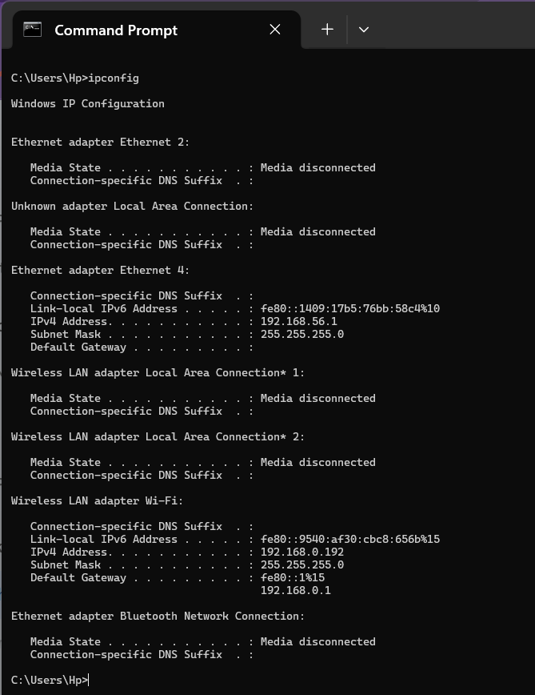
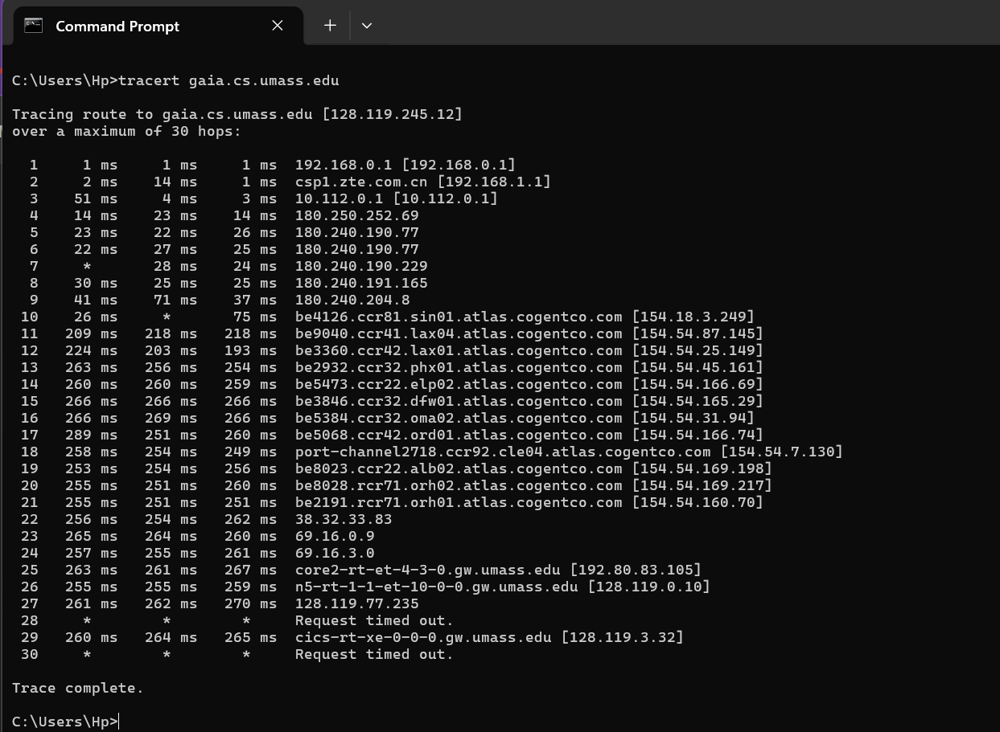
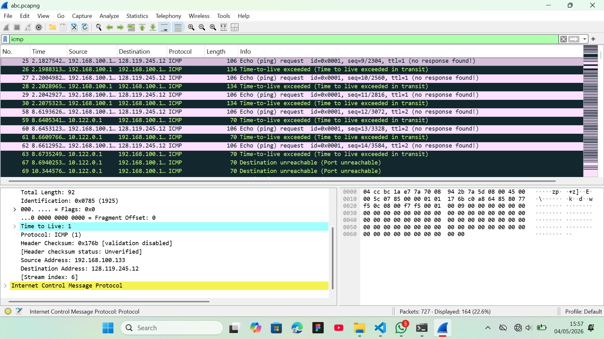
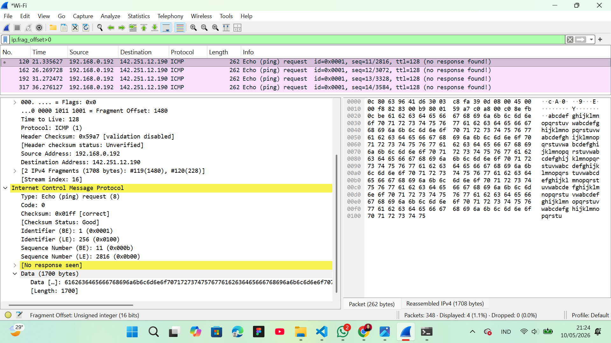
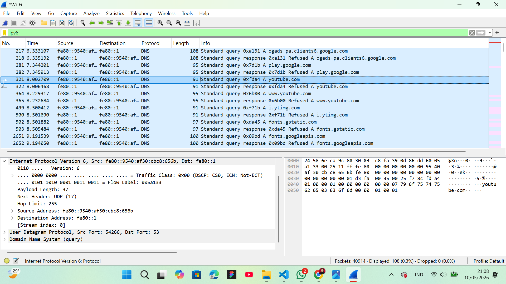

# MODUL 10 : IP

## 1. APA ITU IP Adrres?

**IP Address (Internet Protocol Address)** adalah penanda numerik(berbentuk nomor) unik yang diberikan kepada setiap perangkat yang terhubung ke jaringan komputer. Dia berfungsi sebagai identitas agar perangkat bisa saling berkomunikasi dan bertukar data.

### Fungsinya
**Identifikasi Host:** Menentukan "siapa" perangkat tersebut di dalam jaringan.
**Lokasi Logis:** Menentukan "di mana" posisi perangkat tersebut agar router bisa mengirimkan data ke tujuan yang tepat.

### Pengamatan dalam Konfigurasi IP yang saya coba menggunakan perintah ipconfig pada cmd
Langkahnya:
1. Buka CMD
2. Lakukan perintah `ipconfig`

Berdasarkan pengamatan pada perintah `ipconfig`, terdapat tiga komponen:

| Komponen | Fungsi | Contoh (dari Gambar) |
| --- | --- | --- |
| **IPv4 Address** | Alamat unik perangkat Saya | `192.168.0.192` |
| **Subnet Mask** | Memisahkan bagian Network ID dan Host ID | `255.255.255.0` |
| **Default Gateway** | Alamat "pintu keluar" (Router) menuju internet | `192.168.0.1` |

### Jenis-Jenis IP

* **IPv4:** Format 32-bit (contoh: `192.168.1.1`).
* **IPv6:** Format 128-bit untuk mengatasi keterbatasan jumlah alamat (contoh: `fe80::9540...`).
* **IP Publik:** Alamat yang dikenali di internet global.
* **IP Privat:** Alamat yang hanya berlaku di jaringan lokal (seperti WiFi rumah).

## 2. TRACEROUTE DARI SUATU WEBSITE

Program tracert yang disediakan dengan Windows tidak mengizinkan seseorang
untuk mengubah ukuran pesan ICMP yang dikirim oleh tracert. Jadi tidak mungkin
menggunakan mesin Windows untuk menghasilkan pesan ICMP yang cukup besar untuk
memaksa fragmentasi IP. Namun, Kita dapat menggunakan tracert untuk menghasilkan paket kecil dengan panjang tetap untuk melakukan Bagian 1 lab ini.
Langkah ujinya:
1. Buka CMD pada laptop
2. Ketikkan perintah `tracert gaia.cs.umass.edu` dan tunggu sampai proses tracing selesai

Dalam proses *traceroute*, IP Address digunakan untuk memetakan jalur. Setiap router yang dilewati akan mengirimkan pesan **ICMP TTL-Exceeded**. Dengan melihat **Source IP** pada pesan tersebut, kita bisa mengetahui daftar "lompatan" (hops) yang dilalui paket data dari pengirim ke tujuan (misalnya ke `gaia.cs.umass.edu`).

Analisis *traceroute* ke **`gaia.cs.umass.edu` [128.119.245.12]** menunjukkan jalur data yang melintasi 30 titik lompatan (*hops*), dimulai dari **IP Privat lokal [192.168.0.1]** hingga mencapai jaringan **UMass [128.119.3.32]** di Amerika Serikat. Proses ini bekerja dengan menaikkan nilai **TTL (Time-to-Live)** secara bertahap, di mana setiap router perantara seperti **`be4126.ccr81.sin01.atlas.cogentco.com` [154.18.3.249]** melaporkan keberadaannya menggunakan pesan ICMP sebelum paket diteruskan. Lonjakan *latency* yang signifikan (dari 26ms ke 218ms) pada lompatan internasional menjadi penanda fisik bahwa paket data sedang berpindah antarbenua melalui jaringan *backbone* global.

## 3. APA ITU ICMP, MTU, TTL?

**ICMP (Internet Control Message Protocol)**
ICMP adalah protokol pendukung dalam jaringan internet yang digunakan oleh perangkat seperti router dan host untuk mengirimkan pesan kesalahan serta informasi operasional. Protokol ini tidak digunakan untuk mengirimkan data pengguna, melainkan bertindak sebagai mekanisme pelaporan jika suatu tujuan tidak dapat dijangkau atau jika paket data harus dibuang karena waktu hidupnya habis. Contoh penggunaan ICMP yang paling umum adalah pada perintah `ping` untuk menguji konektivitas dan `traceroute` untuk memetakan jalur komunikasi melalui pesan *TTL-exceeded*.

**MTU (Maximum Transmission Unit)**
MTU adalah batas ukuran kapasitas maksimum dari sebuah paket data atau *frame* yang dapat ditransmisikan melalui sebuah jalur komunikasi fisik seperti Ethernet atau WiFi. Standar MTU yang paling sering digunakan pada jaringan internet adalah **1500 byte**. Jika sebuah paket data yang dikirim memiliki ukuran melebihi batas ini, maka perangkat jaringan harus melakukan **fragmentasi** (memecah paket menjadi bagian-bagian kecil) agar data tersebut tetap bisa dilewatkan. Pengaturan MTU yang tidak tepat dapat menyebabkan penurunan performa jaringan atau kegagalan pengiriman data jika router dilarang melakukan pemecahan paket.

**TTL (Time-to-Live)**
TTL adalah sebuah nilai numerik pada header paket IPv4 yang berfungsi sebagai mekanisme pencegahan agar paket data tidak berputar-putar selamanya di dalam jaringan jika terjadi kesalahan rute (*routing loop*). Setiap kali sebuah paket melewati satu router (*hop*), nilai TTL ini akan dikurangi satu, dan jika nilai tersebut mencapai angka nol, router akan membuang paket tersebut serta mengirimkan pesan balik ICMP ke pengirim asli. Dalam protokol IPv6, fungsi yang identik dengan TTL ini berganti nama menjadi **Hop Limit**, namun tetap memegang prinsip kerja yang sama untuk menjaga stabilitas lalu lintas data.

Praktik pakai file abc.pcapng di kelas:
1. buka file abc.pcapng
2. filter icmp
3. echo-> ngirim ke suatu router (yang atas sendiri line nya)
4. TTL NYA 1 (line 1)
5. ICMP ECHO NYA 8

## 4. CONTOH FRAGMENTASI DI WIRESHARK

Fragmentasi IP adalah proses memecah sebuah paket data (datagram) yang besar menjadi beberapa bagian yang lebih kecil agar dapat melewati jalur komunikasi yang memiliki batasan ukuran paket tertentu.

Langkah-langkah:
1. Buka wireshark dan pilih wifi (otomatis akan start pengambilan paket)
2. Buka CMD dan ketikkan perintah `ping youtube.com -l 1700` (tujuannya mengirim paket sebesar (1700) yang melebihi MTU(1500) sehingga menyebabkan fragmentasi)
3. Buka kembali wireshark dan stop capture

Analisis fragmentasi pada Wireshark menunjukkan paket **ICMP** dari `192.168.0.192` ke `142.251.12.190` yang dipecah menjadi dua fragmen karena ukurannya melebihi batasan MTU jaringan (1500 bytes). Terdeteksi bahwa data asli sebesar 1700 bytes dibagi menjadi fragmen pertama dengan **Fragment Offset 0** dan fragmen kedua dengan **Fragment Offset 1480**, di mana keduanya memiliki **Identification ID** yang sama agar dapat disusun kembali oleh pihak penerima. Hal ini membuktikan teori bahwa lapisan IP secara otomatis membagi datagram besar menjadi potongan-potongan kecil demi menyesuaikan dengan kapasitas transmisi jalur fisik yang dilewati.

## 5. IPV6 DI WIRESHARK YANG SUDAH SAYA LAKUKAN SENDIRI
**IPv6 (Internet Protocol version 6)** adalah versi terbaru dari protokol internet yang berfungsi sebagai sistem identitas dan lokasi untuk komputer dalam jaringan, sekaligus mengarahkan lalu lintas data di internet. IPv6 diciptakan oleh IETF (Internet Engineering Task Force) untuk menggantikan IPv4 yang kapasitasnya mulai habis.

Langkah-langkah yang telah saya lakukan:
1. Buka wireshark dan masuk ke Wi-Fi, kemudian start untuk mengambil data
2. Buka `youtube.com` pada chrome
3. Cari konten yang lagi live saat itu, kemudian tonton live tersebut selama 1 menitan
4. Buka kembali wireshark dan stop capture
5. Filter `ipv6` pada wireshark lalu enter
Berikut tampilan hasil dari penangkapan ipv6 yang telah saya coba

Analisis pada Wireshark menunjukkan penggunaan **IPv6** untuk protokol DNS, di mana perangkat pengirim dengan alamat *Link-Local* **`fe80::9540:af30:cbc8:656b`** berkomunikasi langsung dengan *gateway* **`fe80::1`**. Paket ini membawa data (*payload*) sebesar **37 byte** menggunakan protokol **UDP** untuk menanyakan domain `youtube.com`, dengan penanda khusus berupa **Hop Limit 255** sebagai pengganti TTL dan fitur **Flow Label `0x5a133**` untuk efisiensi antrean data. Penggunaan alamat berbasis heksadesimal 128-bit ini membuktikan transisi dari IPv4 ke arsitektur yang lebih luas, di mana header paket menjadi lebih ringkas namun tetap mampu menangani identifikasi rute secara akurat dalam jaringan lokal. Alamat-alamat di atas mempunyai format heksadesimal dengan tanda titik dua (:) yang merupakan ciri khasnya ipv6.
