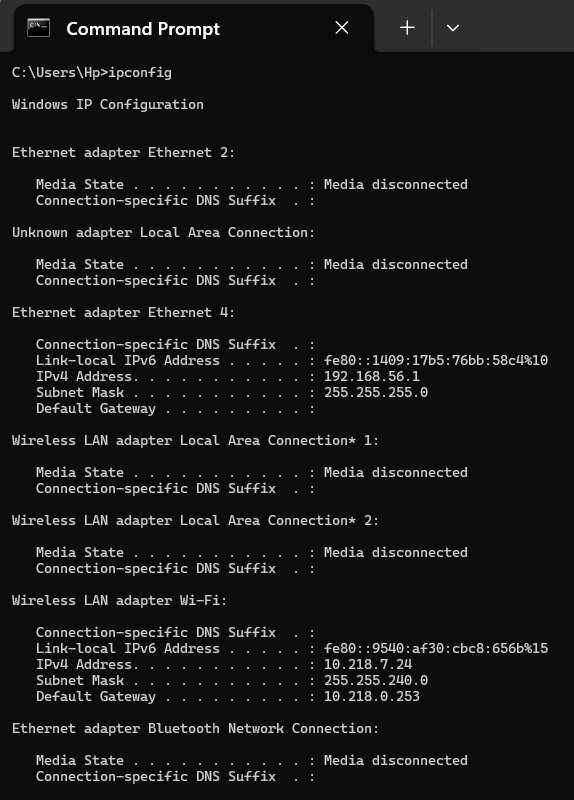
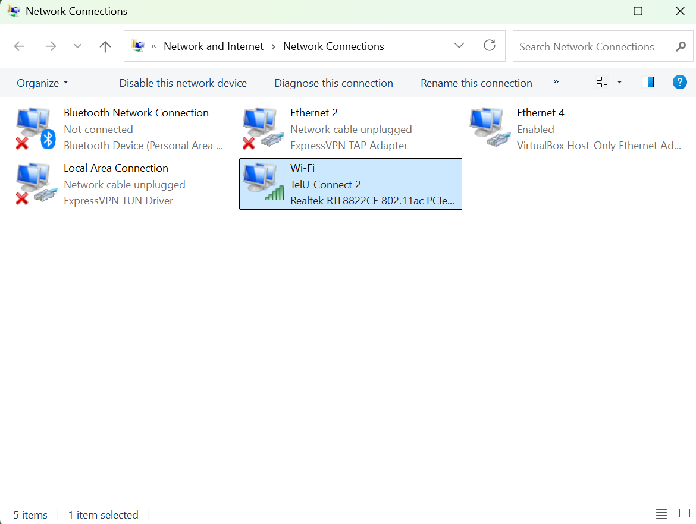
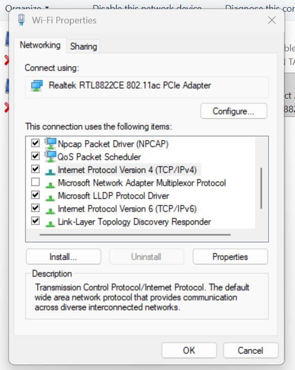
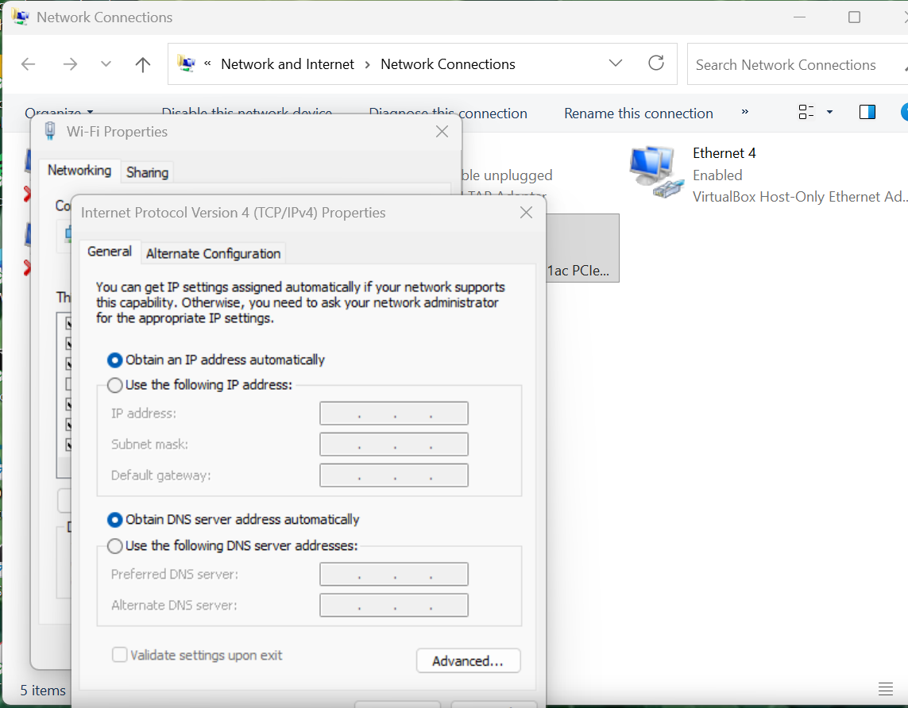
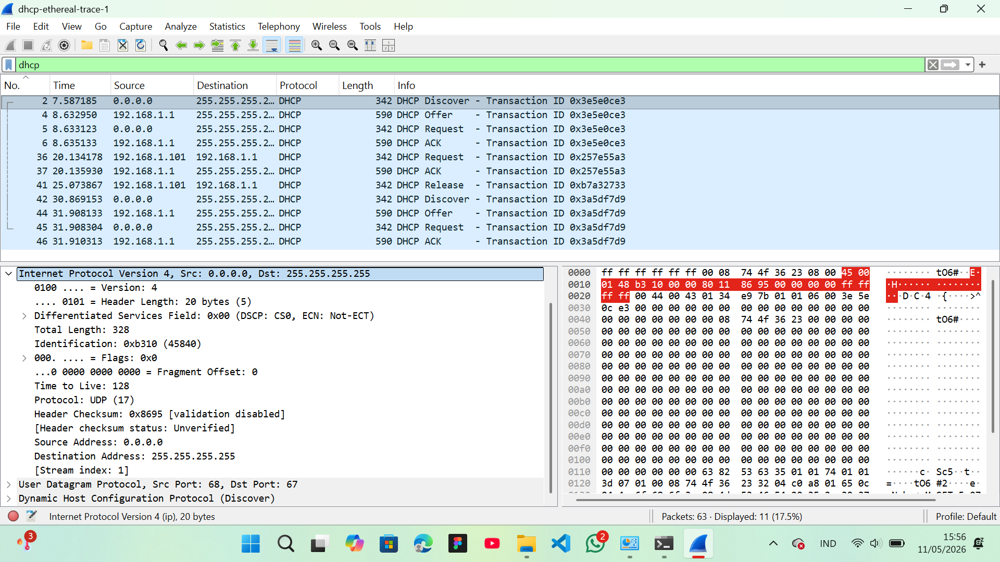

# Modul 11 DHCP

## APA ITU DHCP?
DHCP adalah protokol jaringan yang secara otomatis memberikan konfigurasi IP kepada perangkat yang terhubung ke jaringan, tanpa perlu pengaturan manual.
Ketika sebuah perangkat (komputer, HP, printer) terhubung ke jaringan, DHCP server akan otomatis memberikan:

1. IP Address (misal: 192.168.1.10)
2. Subnet Mask (misal: 255.255.255.0)
3. Default Gateway (misal: 192.168.1.1)
4. DNS Server (misal: 8.8.8.8)

## KELEBIHAN DAN KEKURANGAN DHCP
### KELEBIHAN:
1. Otomatis & Efisien: Tidak perlu setting IP manual satu per satu
2. Menghindari IP konflik: Server memastikan tidak ada dua perangkat dengan IP yang sama
3. Manajemen Mudah: Admin cukup kelola dari satu server terpusat
4. Fleksibel: IP dapat digunakan ulang saat perangkat tidak aktif (lease)5Cocok untuk Jaringan Besar. Sangat membantu jika ada ratusan/ribuan perangkat
6. Perubahan Konfigurasi Mudah: Cukup ubah di server, semua perangkat ikut update
### KEKURANGAN:
1. IP Berubah-ubah: Perangkat bisa mendapat IP berbeda setiap koneksi
2. Ketergantungan pada Server: Jika DHCP server mati, perangkat tidak bisa dapat IP
3. Keamanan Rentan: Risiko DHCP Spoofing, server palsu bisa memberikan IP berbahaya
4. Tidak Cocok untuk Server: Server/printer sebaiknya pakai IP statis agar mudah diakses
5. Sulit Dilacak: IP yang berubah menyulitkan pelacakan perangkat tertentu

## PROSES DORA
Perangkat -> DISCOVER               -> Mencari DHCP server

Server    -> OFFER                  -> Menawarkan IP

Perangkat -> REQUEST                -> Meminta IP tersebut

Server    -> ACK(Acknowledge)       -> Konfirmasi, IP diberikan

Tahap pertama adalah Discover. Pada tahap ini, client yang baru terhubung ke jaringan belum memiliki alamat IP sama sekali, sehingga alamat sumber yang digunakan adalah 0.0.0.0. Karena client juga belum mengetahui keberadaan DHCP server di jaringan, maka paket dikirimkan secara broadcast ke alamat 255.255.255.255 agar dapat diterima oleh semua perangkat dalam jaringan, termasuk DHCP server. Paket Discover ini pada dasarnya adalah seruan client untuk mencari DHCP server yang tersedia.

Tahap kedua adalah Offer. Setelah DHCP server menerima paket Discover dari client, server akan merespons dengan mengirimkan paket Offer yang berisi penawaran konfigurasi jaringan. Di dalam paket ini, server menyertakan alamat IP yang akan diberikan kepada client, subnet mask, default gateway, alamat DNS server, serta durasi lease time atau masa sewa IP tersebut. Paket Offer masih dikirim secara broadcast karena client belum memiliki IP resmi yang dapat dijadikan tujuan pengiriman.

Tahap ketiga adalah Request. Setelah client menerima satu atau lebih paket Offer dari server yang ada di jaringan, client akan memilih salah satu penawaran dan mengirimkan paket Request sebagai tanda persetujuan. Paket ini dikirim kembali secara broadcast agar server lain yang juga mengirimkan Offer mengetahui bahwa tawarannya tidak dipilih, sehingga mereka dapat menarik kembali penawaran tersebut. Paket Request memuat Transaction ID yang sama dengan proses Discover dan Offer sebelumnya agar server dapat mengidentifikasi sesi komunikasi yang sedang berlangsung.

Tahap keempat adalah Acknowledgement atau ACK. Ini merupakan tahap terakhir di mana DHCP server mengirimkan konfirmasi resmi kepada client bahwa alamat IP beserta konfigurasi jaringan lainnya telah sah diberikan. Setelah menerima paket ACK, client akan mengonfigurasi antarmuka jaringannya menggunakan parameter yang diberikan dan mulai dapat berkomunikasi dalam jaringan. Sejak saat ini, client memegang IP tersebut selama durasi lease time yang telah disepakati, dan wajib melakukan proses renewal sebelum masa sewa habis agar IP tidak dicabut kembali oleh server.

## PRAKTIKUM DI KELAS
### Konfigurasi IP dengan ipconfig di CMD
Sebelum analisa paket DHCP, kita harus mengecek IP yang sedang aktif di komputer terlebih dahulu, ceknya menggunakan perintah `ipconfig` pada CMD seperti gambar dibawah ini:



### Konfigurasi DHCP pada Network Properties
Langkahnya:
1. Buka Network Connection
2. Klik kanan WIFI yang saat ini digunakan, lalu masuk ke properties
3. Setelah tampilan menunjukkan gambar kedua dari gambar dibawah ini, klik yang `Internet Protokol Version 4`
4. Setelah masuk ke gambar ketiga, cek apakah Obtain an IP address automatically dan Obtain DNS server address automatically sudah aktif atau belum, kalau belum aktifkan Obtain an IP address automatically dan Obtain DNS server address automatically sampai seperti gambar dibawah ini: 







### Analisa Paket DHCP pada Wireshark
Contoh pada file dhcp-ethernal-trace-1 waktu praktikum:
1. Buka file `dhcp-ethernal-trace-1` pada wireshark
2. Masukkan filter `dhcp` untuk menampilkan paket dhcp

```
dhcp
```


Penjelasan: Berdasarkan hasil capture Wireshark yang telah dilakukan, teridentifikasi tiga sesi komunikasi DHCP yang merepresentasikan proses DORA secara lengkap. DHCP server yang aktif dalam jaringan ini menggunakan alamat IP 192.168.1.1, sedangkan client yang meminta konfigurasi IP berasal dari alamat 0.0.0.0 karena belum memiliki IP yang ditetapkan.

Pada sesi pertama dengan Transaction ID 0x3e5e0ce3, proses DORA berjalan secara penuh. Diawali pada detik ke-7.587185, client mengirimkan paket DHCP Discover dari alamat 0.0.0.0 ke alamat broadcast 255.255.255.255 karena client belum memiliki alamat IP dan belum mengetahui keberadaan DHCP server di jaringan. Server kemudian merespons pada detik ke-8.632950 dengan paket DHCP Offer yang menawarkan konfigurasi IP kepada client. Setelah menerima tawaran tersebut, client membalas dengan paket DHCP Request pada detik ke-8.633123 sebagai tanda persetujuan terhadap IP yang ditawarkan. Server kemudian mengonfirmasi dengan mengirimkan paket DHCP ACK pada detik ke-8.635133, yang menandakan bahwa IP telah resmi diberikan kepada client.

Pada sesi kedua dengan Transaction ID 0x257e55a3, proses yang terjadi bukanlah DORA penuh, melainkan proses renewal atau perpanjangan masa sewa IP. Pada detik ke-20.134178, client yang kini telah memiliki IP 192.168.1.101 langsung mengirimkan paket DHCP Request secara unicast langsung ke server 192.168.1.1 tanpa melalui tahap Discover dan Offer. Hal ini terjadi karena client hanya ingin memperpanjang IP yang sudah dimilikinya, sehingga tidak perlu memulai proses pencarian dari awal. Server kemudian merespons dengan paket DHCP ACK pada detik ke-20.135930 sebagai konfirmasi perpanjangan lease.

Setelah proses renewal, pada detik ke-25.073867 terjadi peristiwa DHCP Release dengan Transaction ID 0xb7a32733, di mana client dengan IP 192.168.1.101 secara aktif mengembalikan alamat IP-nya kepada server. Proses ini umumnya terjadi ketika perangkat melakukan disconnect atau shutdown, sehingga IP dapat digunakan kembali oleh perangkat lain.

Setelah melepaskan IP-nya, client memulai kembali proses DORA penuh pada sesi ketiga dengan Transaction ID 0x3a5df7d9. Dimulai dari detik ke-30.869153, client kembali mengirimkan DHCP Discover ke broadcast, diikuti dengan DHCP Offer dari server pada detik ke-31.908133, lalu DHCP Request dari client pada detik ke-31.908304, dan diakhiri dengan DHCP ACK dari server pada detik ke-31.910313. Dengan demikian, client berhasil mendapatkan kembali konfigurasi IP dari server untuk dapat berkomunikasi dalam jaringan.