# HTTP

## Basic HTTP GET/response interaction
HTTP GET adalah permintaan dari browser kepada server untuk mengambil data tertentu, ini langkahnya:

1. Setelah membuka wireshark, pilih Wi-Fi untuk memproses paket 
2. Start dengan menekan tombol hiu
3. Mengakses link http://gaia.cs.umass.edu/wireshark-labs/HTTP-wireshark-file1.html pada browser masing masing, saya menggunakan chrome

gambar:
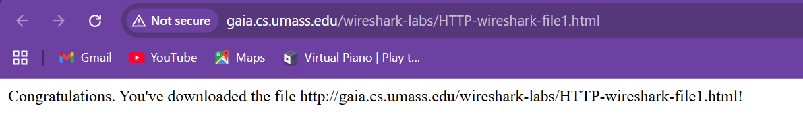

4. Pergi ke wireshark lagi untuk melihat capture paket
5. Gunakan filter "http" pada wireshark untuk menampilkan paket HTTP
6. Stop dengan menekan kotak di sebelah hiu

gambar hasil: 
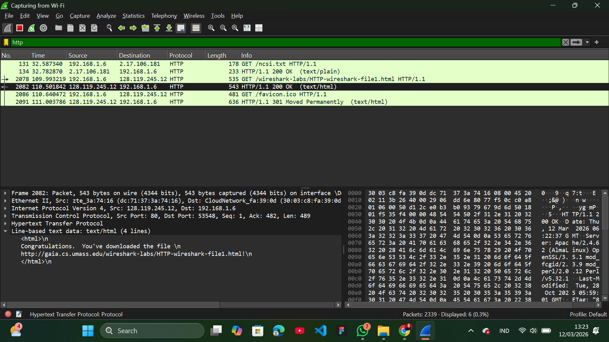
Pada gambar ini terlihat blok warna hitam ada tulisan 200 OK, itu tandanya browser dikasih respons balik dari server yang menyatakan bahwa permintaan tersebut berhasil diproses.

### HTTP CONDITIONAL GET/response interaction

1. Buka browser dan hapus terlebih dahulu cache dan history browser
2. Buka wireshark dan start dengan menekan tombol hiu
3. Buka browser lagi dan masukkan link berikut http://gaia.cs.umass.edu/wireshark-labs/HTTP- wireshark-file2.html akan menampilkan file HTML lima baris yang sangat sederhana.

gambar:
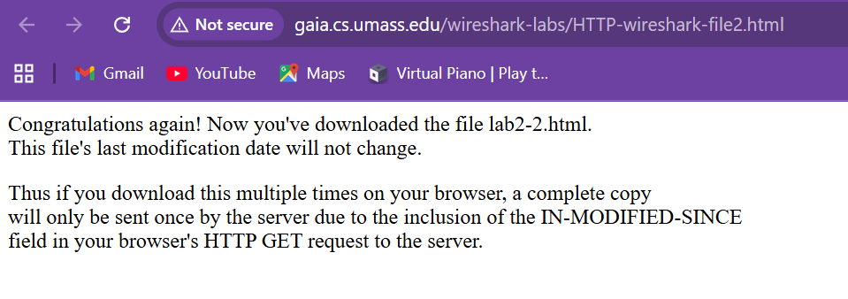

4. Masukkan kembali link yang sama ke browser dengan cepat (atau cukup tekan tombol
refresh di browser).
5. Stop pengambilan paket Wireshark dengan menekan tombol kotak, dan masukkan “http” untuk filter, sehingga hanya pesan HTTP yang diambil yang akan ditampilkan nanti di layar daftar paket.

gambar hasil:
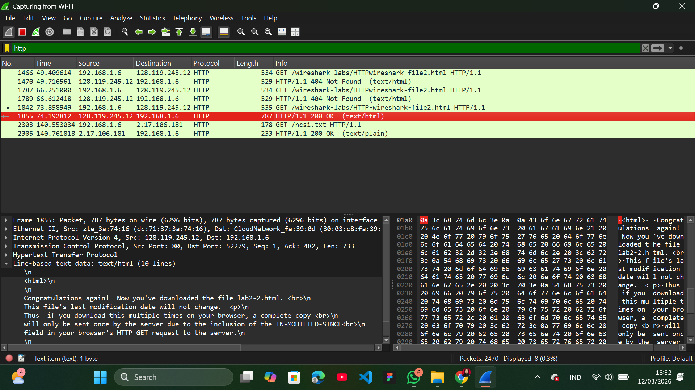
Seperti pada poin sebelumnya, ada tulisan 200 OK yg menandakan permintaan paket telah diterima oleh server. Berkat If-Modified-Since, browser tidak perlu mengunduh file yang sama berulang kali secara utuh. Saat membuka halaman yang sama, browser cukup bertanya, "Apa file ini ada perubahan sejak terakhir saya ambil?" Jika tidak ada perubahan, server tidak akan mengirim file itu lagi, sehingga kuota internet lebih hemat dan proses loading jadi jauh lebih cepat. Ini yang dinamakan cache. Jadi kalau di refresh yang masuk di pengambilan paket hanya yang pertama atau satu file saja.

## Retrieving Long Documents
1. Buka browser dan hapus terlebih dahulu cache dan history browser
2. Buka wireshark dan start dengan menekan tombol hiu
3. Buka browser lagi dan masukkan link berikut http://gaia.cs.umass.edu/wireshark-labs/HTTP-wireshark-file3.html Browser seharusnya menampilkan Bill of Rights AS yang cukup panjang.

gambar:
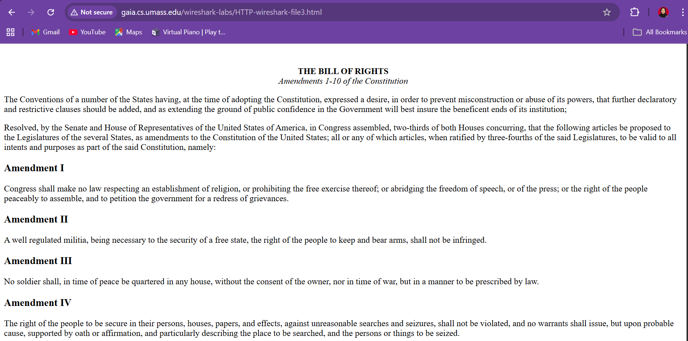

4. Stop pengambilan paket Wireshark dengan menekan tombol kotak, dan masukkan “http” untuk filter, sehingga hanya pesan HTTP yang diambil yang akan ditampilkan.

gambar hasil:
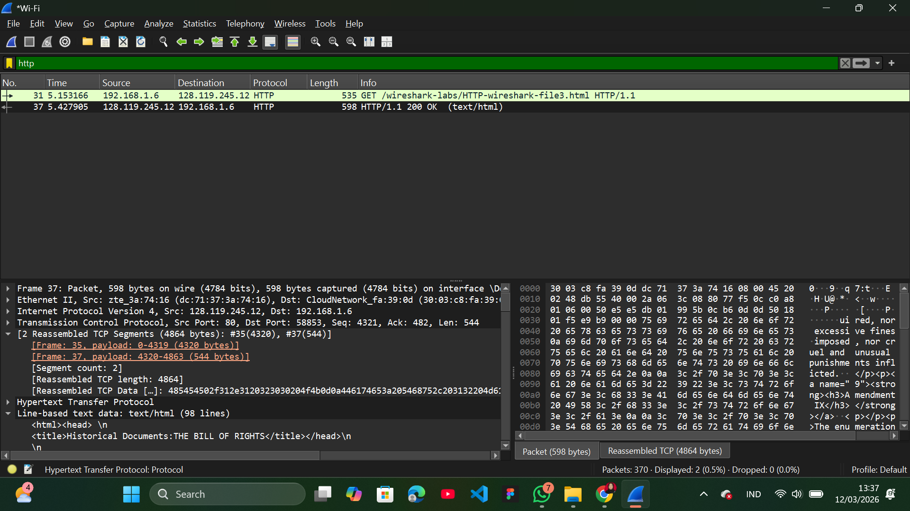
Blok hitam menunjukkan status 200 OK, yang berarti server mengirimkan seluruh isi file secara utuh (terlihat ada 98 baris teks HTML di bagian bawah). Ini terjadi karena browser belum memiliki salinan file tersebut, sehingga browser tidak mengirimkan If-Modified-Since. Jika nanti kita mengakses halaman yang sama lagi, barulah browser akan mengirimkan permintaan Conditional GET untuk mengecek perubahan. Jika file belum berubah, statusnya tidak akan lagi 200 OK, melainkan 304 Not Modified, dan server tidak perlu mengirimkan ulang 98 baris teks tersebut.

## HTML Documents dengan Embedded Objects

1. Buka browser dan hapus terlebih dahulu cache dan history browser
2. Buka wireshark dan start dengan menekan tombol hiu
3. Buka browser lagi dan masukkan link berikut http://gaia.cs.umass.edu/wireshark-labs/HTTP-wireshark-file4.html browser harus menampilkan file HTML pendek dengan dua gambar. Kedua gambar ini direferensikan dalam file HTML dasar. Artinya, gambar itu sendiri tidak terdapat dalam HTML. alih-alih hanya terdapat URL kedua gambar pada file HTML tersebut. Browser juga harus mengambil logo ini dari URL situs web yang disematkan pada file HTML. Logo penerbit kita diambil dari situs web gaia.cs.umass.edu.

gambar:
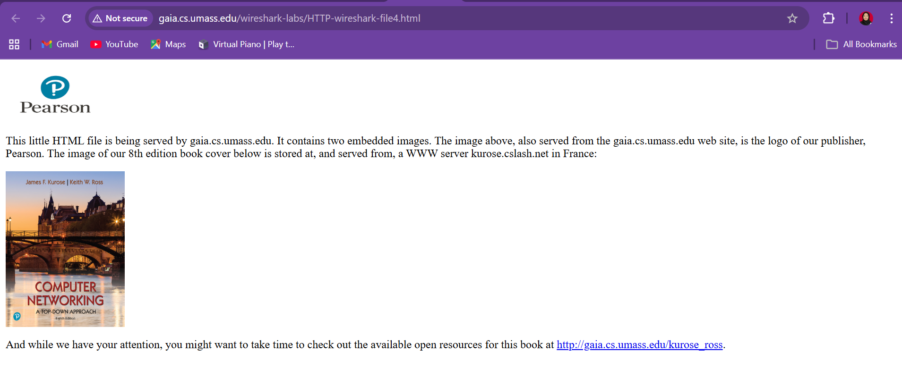

4. Stop pengambilan paket Wireshark dengan menekan tombol kotak, dan masukkan “http” untuk filter, sehingga hanya pesan HTTP yang diambil yang akan ditampilkan.

gambar hasil 1:
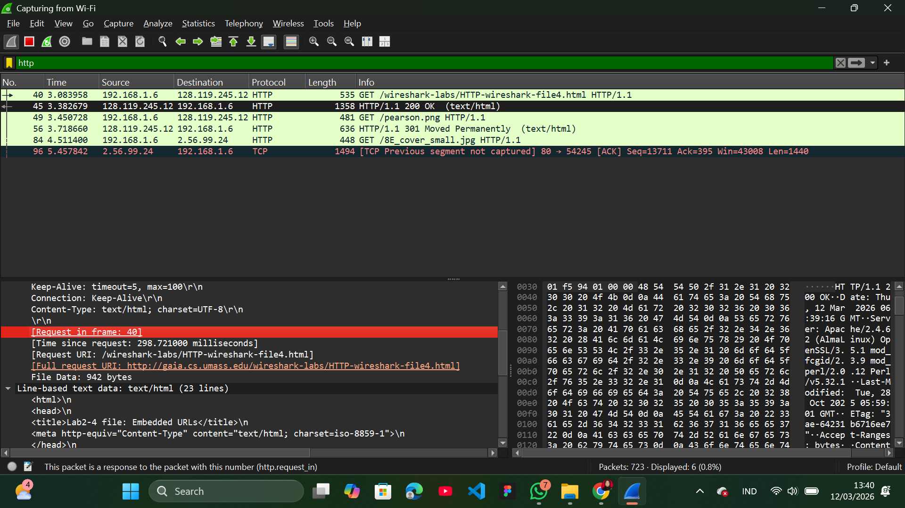
Pada gambar diatas, ada tulisan 200 OK yg menandakan permintaan paket telah diterima oleh server. Disitu juga ada spesifikasi gambarnya pada line html nya, beserta link gambarnya.

gambar hasil 2:
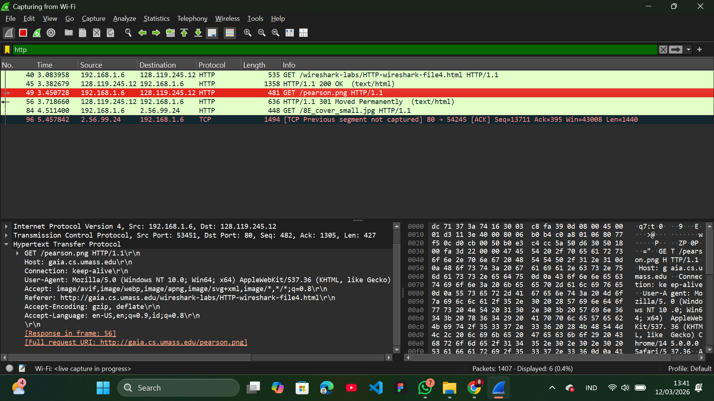
Setelah membaca file HTML tadi, browser melihat ada gambar yang harus diambil, yaitu pearson.png ini penjelasannya.
Baris 49 (GET pearson.png), browser meminta gambar Pearson ke server.
Baris 56 (301 Moved Permanently), server menjawab dengan kode 301. Artinya, file gambar tersebut sudah pindah lokasi secara permanen. Server memberi tahu browser alamat barunya.
Baris 84 (GET /8E_cover_small.jpg), browser otomatis mengikuti petunjuk server dan meminta file gambar di lokasi yang baru (terlihat namanya berubah menjadi 8E_cover_small.jpg).

## HTTP Authentication

1. Buka browser dan hapus terlebih dahulu cache dan history browser
2. Buka wireshark dan start dengan menekan tombol hiu
3. Buka browser lagi dan masukkan link berikut http://gaia.cs.umass.edu/wireshark-labs/protected_pages/HTTP-wireshark-file5.html Ketik username dan password yang diminta ke dalam kotak pop up (username dan password terdapat pada paragraf diatas). Usernamenya adalah "wireshark-students" (tanpa tanda kutip), dan passwordnya adalah "network" (sekali lagi, tanpa tanda kutip).

gambar:

4. Stop pengambilan paket Wireshark dengan menekan tombol kotak, dan masukkan “http” untuk filter, sehingga hanya pesan HTTP yang diambil yang akan ditampilkan.

gambar web berhasil login:
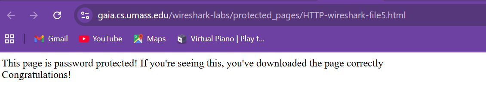

gambar unauthorize:
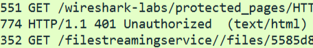
Server memberikan respons 401 Unauthorized. Ini terjadi karena browser mencoba mengakses halaman HTTP-wireshark-file5.html yang berada di folder "protected_pages" tanpa mengirimkan username atau password. Dan Server menjawab, kalian tidak punya izin untuk melihat halaman ini sebelum login.

gambar hasil keseluruhan:
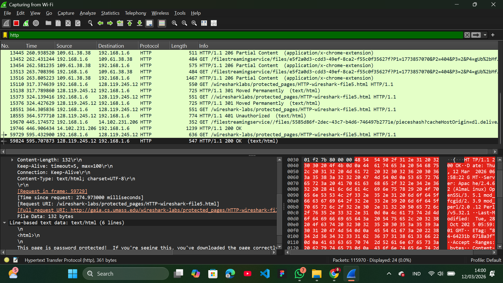
Pada blok hitam server menjawab dengan 200 OK, yang artinya login berhasil. Jika Anda melihat bagian bawah gambar pada teks HTML-nya, muncul tulisan "This page is password protected! If you're seeing this, you've downloaded the page correctly" pada line html. Ini adalah pesan rahasia yang hanya muncul setelah login sukses.
