# DNS
## Tujuan Praktikum
Mahasiswa dapat menginvestigasi cara kerja DNS menggunakan Wireshark
---
## 4.2 NSLOOKUP
Perintah `nslookup` merupakan alat bantu yang berfungsi untuk menerjemahkan nama domain yang mudah diingat manusia menjadi alamat IP yang dapat dipahami oleh mesin dalam jaringan komputer. Saat perintah ini dijalankan, perangkat akan mengirimkan permintaan informasi ke server DNS untuk mencari tahu lokasi server dari suatu situs web, baik itu melalui server perantara maupun server sah (asli). Hasil yang ditampilkan pada terminal memungkinkan kita untuk memverifikasi konfigurasi jaringan serta memastikan bahwa koneksi menuju alamat tujuan sudah terarah dengan benar berdasarkan database DNS yang tersedia.
Adapun sintaks umum perintah nslookup, yaitu:

```nslookup –option1 –option2 host-to-find dns-server```

Secara umum, nslookup dapat dijalankan dengan nol, satu, dua, atau lebih opsi.

Langkah-Langkah:
1. Buka CMD untuk mengetikkan query perintah
2. Masukkan secara bertahap perintah dibawah ini:
### Perintah 1 : nslookup untuk domain www.mit.edu
Menggunakan perintah: 
```nslookup www.mit.edu```

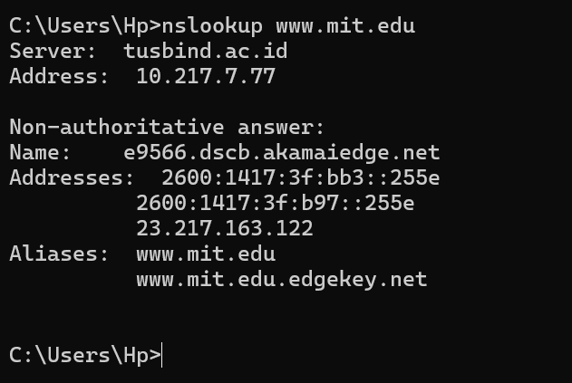

Berdasarkan hasil pengujian menggunakan perintah `nslookup`, sistem melakukan pengecekan alamat IP dari domain `www.mit.edu` melalui DNS server lokal dengan alamat `10.217.7.77`. Laporan ini menunjukkan jawaban bersifat non-authoritative, yang berarti informasi alamat IP diambil dari data cache server antara, bukan langsung dari server utama pemilik domain. Hasil resolusi menunjukkan bahwa domain tersebut terhubung ke jaringan Akamai (CDN) dengan alamat IPv4 `23.217.163.122` serta beberapa alamat IPv6, yang mengindikasikan penggunaan distribusi konten global untuk mengoptimalkan kecepatan akses situs.

### Perintah 2 : identifikasi name server otoritatif pada domain mit.edu
Menggunakan perintah: 
```nslookup –type=NS mit.edu```

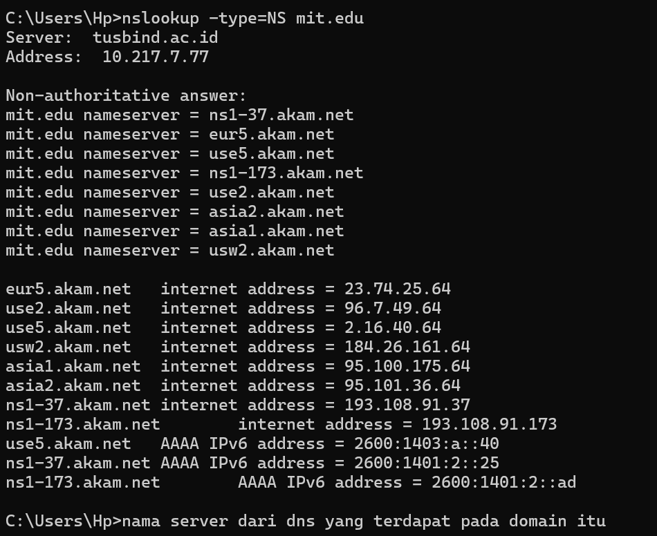

Perintah `nslookup -type=NS mit.edu` digunakan untuk mengidentifikasi daftar server nama (name servers) yang bertanggung jawab secara otoritatif atas pengelolaan domain `mit.edu`. Berdasarkan hasil eksekusi tersebut, domain MIT terlihat menggunakan infrastruktur dari Akamai, yang ditunjukkan oleh deretan nama server seperti `ns1-37.akam.net` hingga `usw2.akam.net` beserta alamat IP (IPv4 dan IPv6) masing-masing. Informasi ini sangat berguna dalam administrasi jaringan untuk mengetahui server mana yang menyimpan catatan DNS asli dari domain tersebut, sehingga proses resolusi nama ke alamat IP dapat dikelola dengan lebih stabil dan terdistribusi secara global.

### Perintah 3 : Percobaan Kueri DNS ke Server Luar
Menggunakan perintah: 
```nslookup www.aiit.or.kr bitsy.mit.edu```

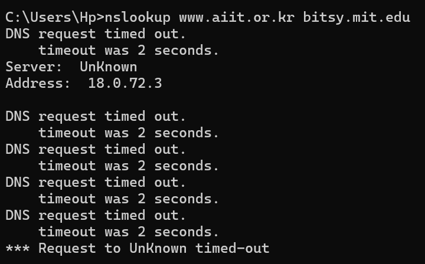

Perintah ini bertujuan untuk melakukan kueri DNS secara langsung ke server bitsy.mit.edu guna mendapatkan alamat IP dari www.aiit.or.kr tanpa melalui server DNS lokal. Dengan mengarahkan permintaan ke server spesifik, diharapkan terjadi pertukaran informasi langsung antara host pengirim dan server tujuan untuk mendapatkan jawaban yang lebih akurat. Namun, hasil pada terminal menunjukkan status DNS request timed out, yang mengindikasikan bahwa server bitsy.mit.edu tidak merespons permintaan tersebut. Hal ini bisa disebabkan oleh server yang sedang tidak aktif, adanya blokir pada kebijakan keamanan jaringan, atau kendala konektivitas yang menghalangi komunikasi antar perangkat secara langsung.

---

## Jawaban dari 3 Pertanyaan
### 1. Pencarian alamat IP untuk domain National University of Singapore (Server Web Asia)


Hasil perintah `nslookup www.nus.edu.sg` menunjukkan proses pencarian alamat IP untuk domain National University of Singapore melalui DNS server dengan alamat 10.92.111.136. Output ini memberikan jawaban bersifat non-authoritative, yang mengindikasikan bahwa informasi alamat IP diperoleh dari rekaman cache pada server lokal dan bukan berasal langsung dari server pusat milik NUS. Berdasarkan hasil tersebut, domain utama diarahkan ke nama alias mgnzsqc.x.incapdns.net dengan alamat IPv4 45.60.35.225, yang menandakan penggunaan layanan keamanan atau akselerasi konten dari Incapsula untuk melindungi dan mengoptimalkan akses menuju situs web tersebut.

### 2. Pencarian server DNS otoritatif Universitas Oxford UK (server DNS otoritatif untuk universitas di Eropa)


Hasil perintah `nslookup -type=NS ox.ac.uk` menunjukkan daftar server nama (name servers) resmi yang bertanggung jawab atas domain Universitas Oxford. Melalui kueri ini, sistem mengidentifikasi beberapa server otoritatif seperti `dns0.ox.ac.uk` hingga `auth6.dns.ox.ac.uk` beserta alamat IP publiknya masing-masing, baik dalam format IPv4 maupun IPv6. Keberadaan banyak server nama ini menunjukkan redundansi infrastruktur jaringan universitas untuk memastikan bahwa layanan resolusi domain tetap stabil dan dapat diakses dari berbagai lokasi. Data ini berfungsi sebagai referensi utama bagi perangkat lain di internet untuk menemukan alamat IP yang tepat dari semua layanan atau situs web yang berada di bawah naungan domain Oxford.

### 3. Mencari mail server Yahoo melalui DNS yang ada di nomor 2, dan mencari IP nya

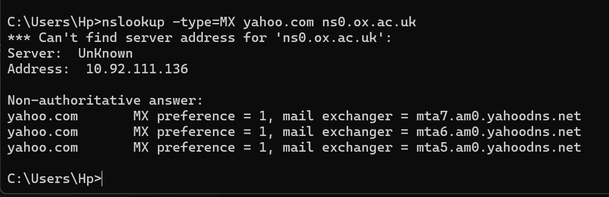

Berdasarkan hasil praktik pada domain `yahoo.com` menggunakan server DNS perantara `ns0.ox.ac.uk`, sistem berhasil mendapatkan rekaman *Mail Exchanger* (MX) yang terdiri dari `mta5.am0.yahoodns.net`, `mta6.am0.yahoodns.net`, dan `mta7.am0.yahoodns.net`. Masing-masing server memiliki nilai *preference* sebesar 1, yang menunjukkan bahwa Yahoo! menggunakan beberapa server dengan prioritas setara untuk menangani lalu lintas email masuk. Meskipun terminal hanya menampilkan nama *host* server email tersebut, setiap *host* merujuk pada alamat IP tertentu yang berfungsi sebagai tujuan pengiriman data. Dalam infrastruktur skala besar seperti Yahoo!, alamat IP ini bersifat dinamis dan terdistribusi, di mana alamat IP dari *mail exchanger* tersebut dapat diketahui melalui proses resolusi DNS lanjutan guna memastikan pesan terkirim ke server yang paling optimal secara geografis.
Alamat IP tidak muncul secara otomatis pada perintah tersebut karena `nslookup` hanya memberikan daftar nama server email. Untuk mendapatkan alamat IP pastinya, diperlukan perintah tambahan seperti `nslookup mta5.am0.yahoodns.net`. Berikut praktiknya:


Hasil dari perintah `nslookup mta5.am0.yahoodns.net` menunjukkan proses resolusi nama host dari salah satu server email Yahoo! menjadi daftar alamat IP yang konkret. Terlihat bahwa satu nama host tersebut memiliki banyak alamat IP, seperti `98.136.96.77`, `67.195.228.109`, hingga `67.195.204.72`. Hal ini mengindikasikan bahwa Yahoo! menerapkan teknik *round-robin* DNS atau penggunaan *load balancer* untuk mendistribusikan beban kerja ke berbagai server fisik yang berbeda guna mencegah kelebihan beban (*overload*) pada satu titik. Dengan banyaknya alamat IP yang tersedia, sistem memastikan layanan email tetap stabil dan memiliki ketersediaan tinggi, sehingga jika salah satu server mengalami gangguan, lalu lintas data dapat dialihkan secara otomatis ke alamat IP lain yang masih aktif.

---

## 4.3 IPCONFIG
Perintah ipconfig merupakan alat bantu di Windows yang sangat berguna untuk melihat rincian koneksi internet pada komputer secara cepat. Dengan menjalankan perintah ini, kita bisa mengetahui informasi penting seperti alamat IP (IPv4), subnet mask, hingga pintu keluar jaringan (default gateway) yang sedang digunakan. Selain itu, ipconfig juga sering dipakai untuk mendeteksi masalah koneksi, karena lewat perintah ini kita bisa memastikan apakah komputer sudah terhubung dengan benar ke jaringan atau belum melalui adaptor yang tersedia.

Langkah-Langkah:
1. Buka CMD untuk mengetikkan semua query nya
2. Ada 3 perintah untuk query ipconfig ini, yaitu:
### Untuk Memperoleh Semua Informasi TCP/IP

``` ipconfig /all ```


Hasil perintah `ipconfig /all` tersebut menampilkan rincian konfigurasi jaringan yang lengkap dari perangkat komputer, termasuk status dari berbagai adaptor jaringan yang terpasang. Berbeda dengan perintah biasa, parameter `/all` ini juga menunjukkan Physical Address (MAC Address) yang merupakan identitas unik hardware, serta status DHCP untuk mengetahui apakah alamat IP didapatkan secara otomatis atau manual. Pada gambar terlihat beberapa adaptor seperti ExpressVPN dan VirtualBox sedang dalam kondisi *Media disconnected*, yang berarti adaptor tersebut terpasang secara perangkat lunak namun tidak sedang terhubung ke jaringan aktif saat ini.

### Menampilkan Informasi DNS yang Tersimpan Dalam Host
Ipconfig juga sangat berguna untuk mengelola informasi DNS yang tersimpan dalam host Kita.
Sebelumnya, kita telah mempelajari bahwa sebuah host dapat menyimpan catatan DNS yang baru
saja diperolehnya. Untuk melihat record yang telah disimpan, setelah prompt C:\> masukkan
perintah berikut:

``` ipconfig /displaydns ```

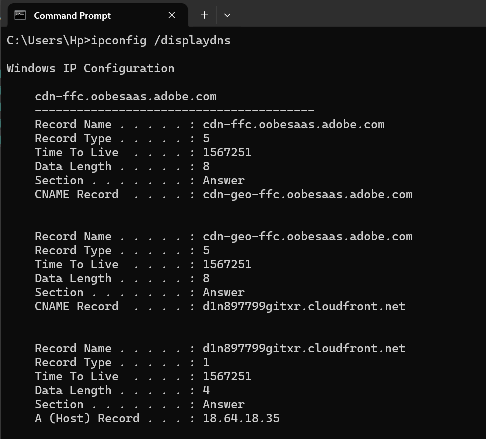

Hasil perintah `ipconfig /displaydns` tersebut menampilkan isi DNS cache pada komputer, yang berisi daftar nama domain yang baru saja dikunjungi beserta alamat IP atau nama aliasnya (CNAME) agar sistem tidak perlu bertanya kembali ke server DNS saat ingin mengakses situs yang sama.

### Menghapus Cache DNS

``` ipconfig /flushdns ```

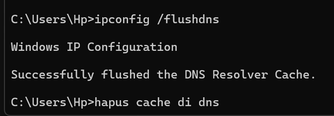

Perintah `ipconfig /flushdns` berfungsi untuk menghapus seluruh riwayat data DNS yang tersimpan sementara pada sistem, sehingga komputer dipaksa untuk meminta informasi alamat IP terbaru dari server DNS saat akan mengakses kembali suatu situs web.

---

## 4.4 TRACING DNS DENGAN WIRESHARK
Langkah-Langkah:
1. Pertama-tama, mari kita tangkap paket DNS yang dihasilkan oleh aktivitas penjelajahan web
biasa. Sebelum itu gunakan `ipconfig /flushdns` untuk mengosongkan catatan DNS di host.


2. Buka browser dan kosongkan cache-nya. (Pada Internet Explorer, buka menu Tools
dan pilih Internet Options; lalu pada tab General pilih Delete Files).


3. Ketik `ipconfig` pada cmd untuk mengetahui alamat IP laptop kita.
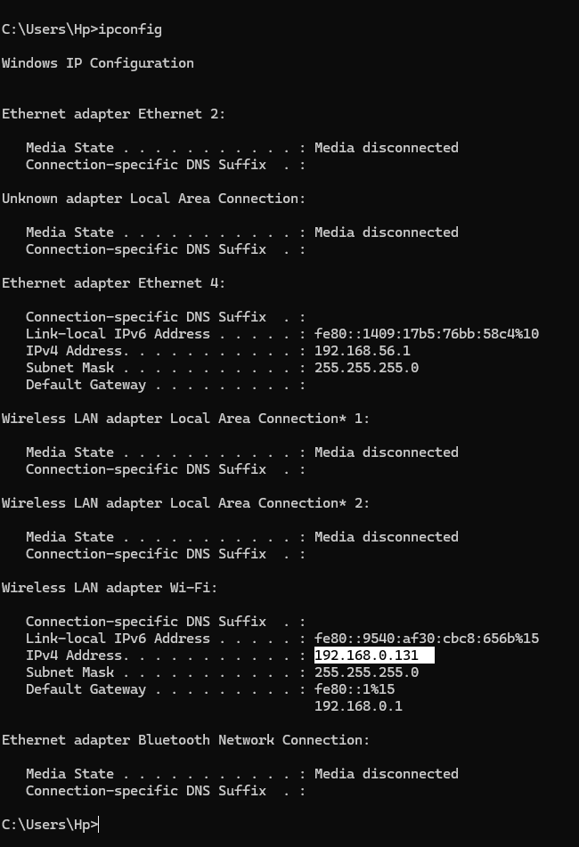

4. Buka Wireshark dan pilih jaringan yang digunakan saat ini.

5. Masukkan `ip.addr == <your_IP_address>` ke dalam filter. Bagian <your_IP_address> diisi dengan alamat IP yang didapatkan melalui ipconfig. Filter ini akan menghapus semua paket yang tidak berasal atau ditujukan ke host.


6. Mulai pengambilan paket di Wireshark.
7. Dengan browser, kunjungi halaman web: http://www.ietf.org


8. Hentikan pengambilan paket setelah halamat dimuat.

---

### Menjawab Pertanyaan
#### 1. Apakah pesan tersebut dikirimkan melalui UDP atau TCP?
Dengan filter : ```ip.addr == 192.168.0.131 && dns.qry.name contains "ietf"```

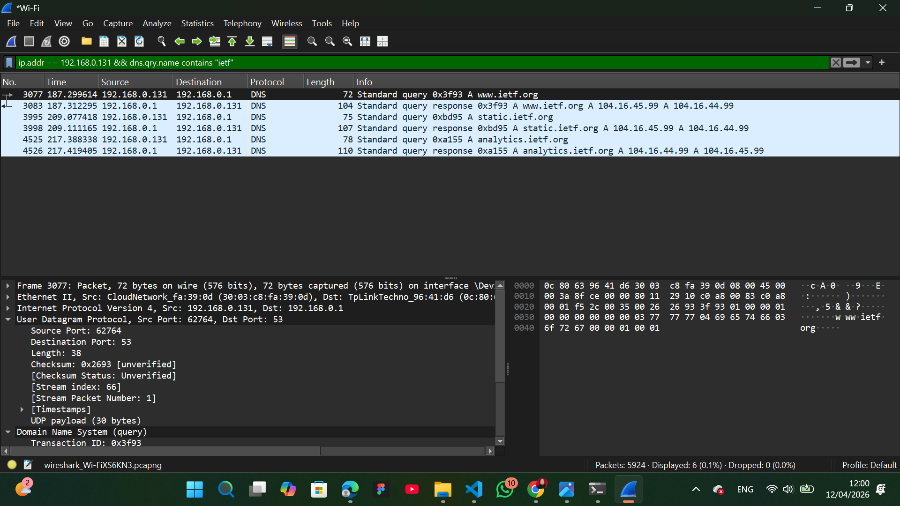

Kita bisa mengetahui bahwa protokol yang digunakan adalah **UDP**. Informasinya ada pada bagian panel detail paket (tengah kiri) yang berbunyi: `User Datagram Protocol, Src Port: 62764, Dst Port: 53`
Berdasarkan hasil pengamatan paket data menggunakan Wireshark, proses kueri DNS antara *host* (`192.168.0.131`) dan DNS server (`192.168.0.1`) dilakukan menggunakan protokol **UDP** (*User Datagram Protocol*) pada port **53**. Pemilihan protokol UDP dilakukan karena karakteristiknya yang ringan dan cepat, sehingga sangat efisien untuk pertukaran pesan kueri dan respons DNS yang berukuran kecil. Berbeda dengan TCP, UDP tidak memerlukan proses *handshake* yang kompleks, sehingga memungkinkan resolusi nama domain terjadi dengan latensi yang minimal.

#### 2. Port Tujuan dan Port Sumber

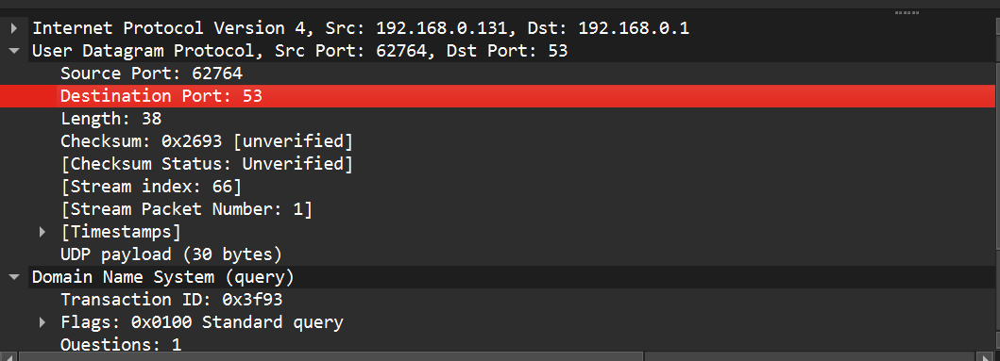

Berdasarkan pengamatan, pesan permintaan DNS (*Query*) dikirim ke **Port Tujuan 53**, yang merupakan port standar untuk layanan DNS pada server. Sebaliknya, pada pesan balasan DNS (Response), server menggunakan **Port Sumber 53** untuk mengirimkan informasi kembali ke perangkat kita. Penggunaan port yang konsisten ini memastikan lalu lintas data antara host dan server DNS terarah dengan benar melalui protokol UDP.

#### 3. Perbandingan Alamat IP Tujuan dan DNS Lokal


Berdasarkan pengamatan pada paket data di Wireshark, pesan permintaan DNS dikirimkan ke alamat IP tujuan **192.168.0.1**. Namun, jika merujuk pada hasil perintah `ipconfig /all` yang dijalankan sebelumnya, alamat DNS server lokal yang terkonfigurasi pada perangkat adalah **10.92.111.136**(Ini bisa di lihat juga pada source di ss an diatas). Perbandingan ini menunjukkan bahwa kedua alamat IP tersebut **berbeda**. Perbedaan ini dapat terjadi karena adanya perubahan koneksi jaringan di antara waktu pengambilan data, penggunaan layanan perantara seperti VPN, atau sistem yang menggunakan alamat *gateway* router sebagai DNS *forwarder* saat proses penangkapan paket berlangsung di Wireshark.

#### 4. DNS. Apa “jenis” atau ”type” dari pesan tersebut? Apakah pesan permintaan tersebut mengandung ”jawaban” atau ”answers”?

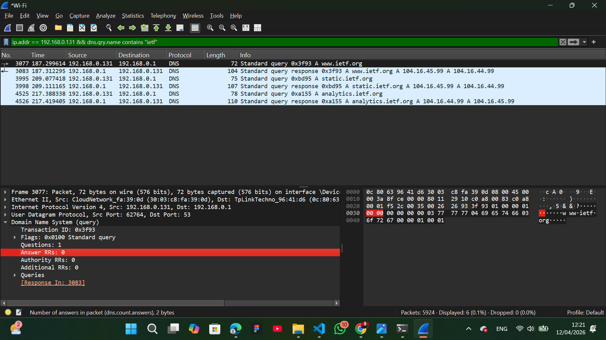

Jenis pesan ini adalah Standard query dengan tipe A (Host Address), yang terlihat pada detail protokol DNS. Permintaan ini tidak mengandung jawaban. Hal ini dibuktikan dengan nilai `Answer RRs: 0` pada panel detail paket. Hal ini wajar karena paket tersebut baru berupa pertanyaan dari klien ke server, sehingga informasi jawaban baru akan tersedia pada paket balasan (response) berikutnya.

#### 5. Berapa banyak ”jawaban” atau ”answers” yang terdapat di dalamnya? Apa saja isi yang terkandung dalam setiap jawaban tersebut?

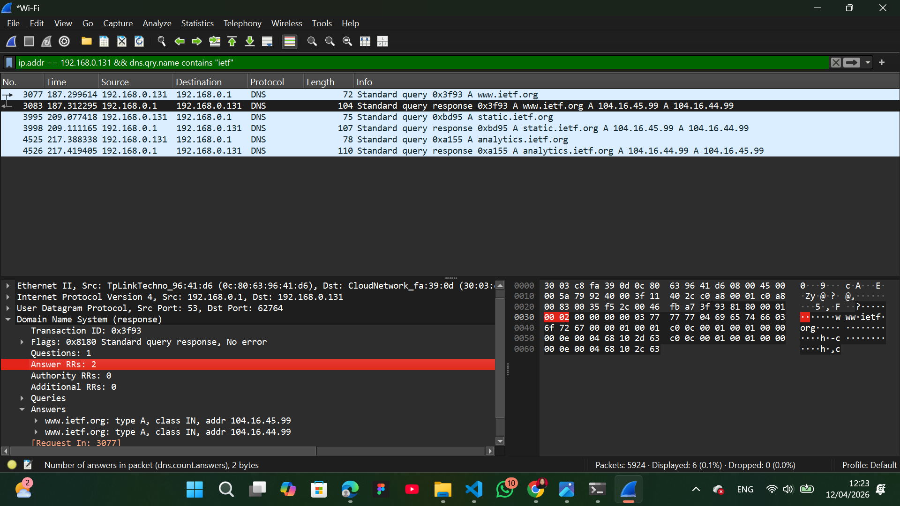

Terdapat 2 jawaban (answers), yang ditunjukkan oleh nilai Answer RRs: 2. Setiap jawaban berisi informasi resolusi nama domain www.ietf.org ke alamat IPv4 yang berbeda. Secara spesifik, isi dari kedua jawaban tersebut adalah:
`Alamat IP 104.16.45.99 (dengan tipe A dan kelas IN).`
`Alamat IP 104.16.44.99 (dengan tipe A dan kelas IN).`

#### 6. Apakah alamat IP pada paket tersebut sesuai dengan alamat IP yang tertera pada pesan balasan DNS?

```tcp.flags.syn == 1 && ip.src == 192.168.0.131 && (ip.dst == 104.16.45.99 || ip.dst == 104.16.44.99)```

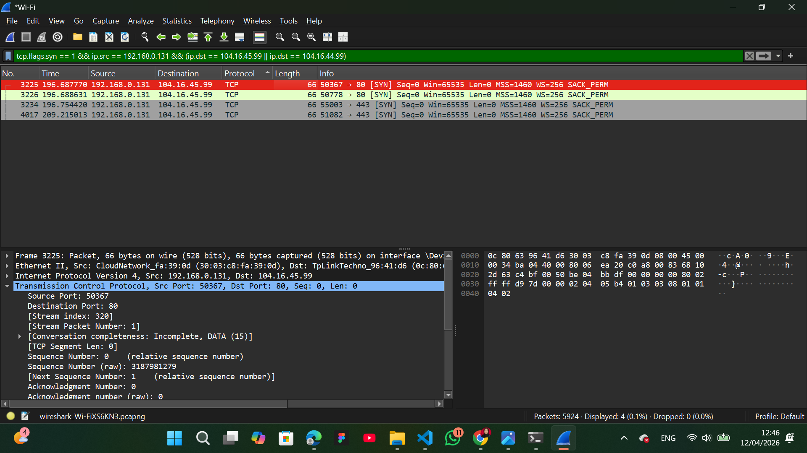

Setelah mendapatkan jawaban dari server DNS, host mengirimkan paket **TCP SYN** untuk memulai koneksi. Berdasarkan daftar paket yang ada, host (`192.168.0.131`) mengirimkan paket SYN tersebut ke alamat IP tujuan **104.16.45.99**. Alamat IP ini **sesuai** dengan salah satu alamat IP yang diberikan oleh server DNS pada pesan balasan sebelumnya. Hal ini membuktikan bahwa sistem langsung menggunakan informasi alamat IP dari hasil resolusi DNS untuk membangun koneksi data (jabat tangan TCP) dengan server tujuan.

#### 7. Apakah host Anda perlu mengirimkan pesan permintaan DNS baru setiap kali ingin mengakses suatu gambar?

```ip.src == 192.168.0.131 && (ip.dst == 104.16.45.99 || ip.dst == 104.16.44.99) && tcp```

Host tidak perlu mengirimkan pesan permintaan DNS baru setiap kali ingin mengakses suatu gambar pada halaman web yang sama. Hal ini dikarenakan setelah kueri DNS pertama untuk domain (seperti www.ietf.org) berhasil dilakukan, alamat IP tersebut akan disimpan sementara di dalam DNS Cache (baik di level browser maupun sistem operasi). Selama masa berlaku data tersebut (Time to Live atau TTL) belum habis, browser akan langsung mengambil alamat IP dari memori cache untuk mengunduh semua aset gambar dari server yang sama. Mekanisme ini sangat krusial untuk mempercepat waktu pemuatan halaman dan mengurangi beban lalu lintas data pada server DNS di internet.

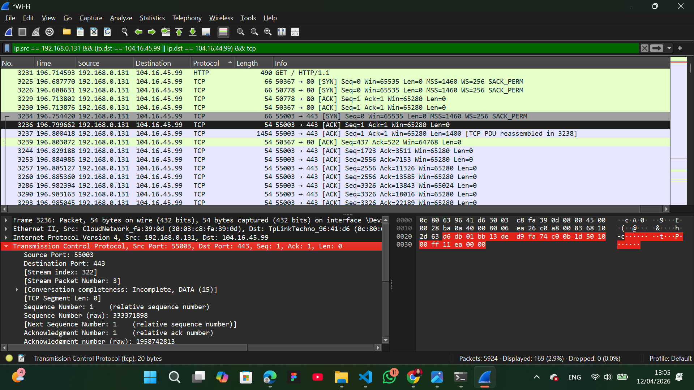

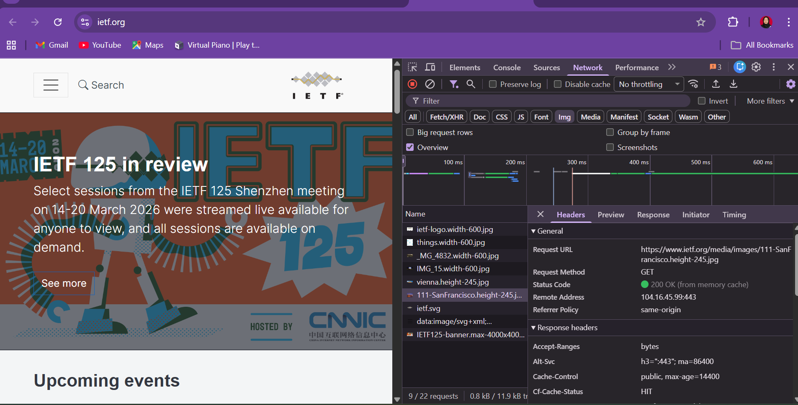

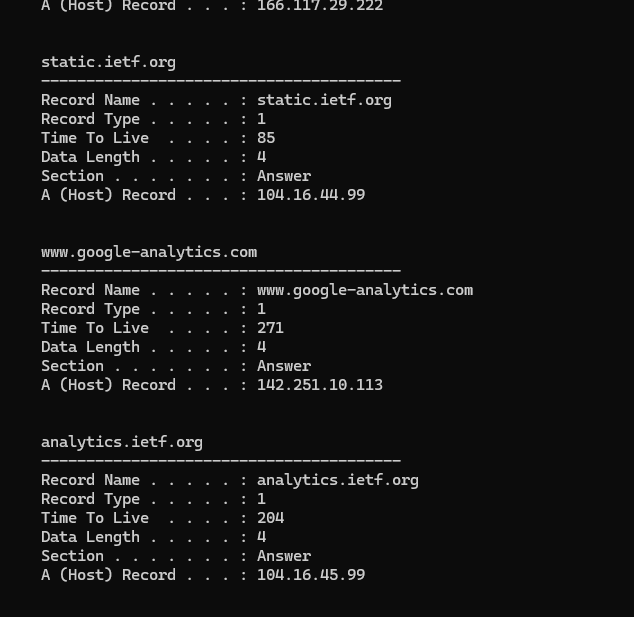

